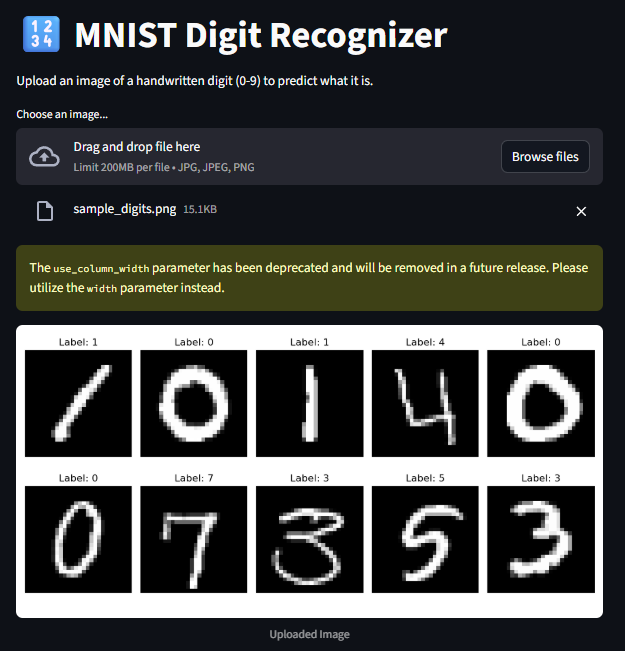
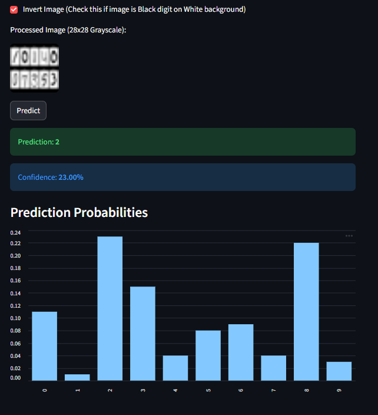

# MNIST Digit Recognizer 🔢

[](https://www.python.org/)
[](https://scikit-learn.org/)
[](https://streamlit.io/)
[](https://opensource.org/licenses/MIT)

> **Live Demo:** [Click Here to Open App](https://digit-detection-wqj3xezwsiexcxcuoe8mto.streamlit.app/)
An end-to-end **Machine Learning** project that accurately identifies handwritten digits (0-9). Built with a robust **Random Forest** classifier and deployed as an interactive web application using **Streamlit**.

---

## 📖 Project Overview

The **MNIST dataset** is a classic benchmark in computer vision, consisting of 28x28 pixel grayscale images of handwritten digits.

- **Goal:** Predict the digit (0-9) from pixel data.
- **Dataset:** 42,000 labeled training images.
- **Model:** Random Forest Classifier (chosen for efficiency and high accuracy on tabular pixel data).

### Key Features

- **🎨 Interactive UI:** Clean, responsive interface built with Streamlit.
- **📤 Drag & Drop Upload:** Supports PNG, JPG, and JPEG formats.
- **🔄 Smart Preprocessing:** Automatic inverted color handling (detects black-on-white text and inverts it to match MNIST's white-on-black format).
- **📊 Real-time Insights:** Displays prediction confidence and probability distribution for all 10 digits.

---

## 🛠️ Tech Stack

- **Core:** Python 3.9+
- **Machine Learning:** scikit-learn (RandomForestClassifier)
- **Web Framework:** Streamlit
- **Data Processing:** NumPy, Pandas
- **Image Processing:** PIL (Pillow)
- **Visualization:** Matplotlib, Seaborn

---

## 📂 Project Structure

```text
mnist-classification/
├── app.py                  # 🚀 Main Streamlit application
├── requirements.txt        # 📦 Project dependencies
├── src/
│   └── mnist_train.py      # 🤖 Model training & evaluation script
├── data/                   # 💾 Dataset storage
│   ├── train.csv           # Training data
│   └── test.csv            # Test data
├── models/
│   └── mnist_model.pkl     # 🧠 Trained serialized model
└── images/                 # 🖼️ Assets for README & UI
    ├── app_ui_main.png
    └── app_ui_prediction.png
```

---

## 🚀 Quick Start

### 1. Clone the Repository

```bash
git clone https://github.com/Khushi-Roy-123/Digit-Detection.git
cd Digit-Detection
```

### 2. Install Dependencies

```bash
pip install -r requirements.txt
```

### 3. Run the App

```bash
streamlit run app.py
```

The app will open automatically at `http://localhost:8501`.

---

## 🧠 Model Training (Optional)

If you wish to retrain the model or regenerate the submission file:

```bash
python src/mnist_train.py
```

This script will:

1. Load dataset from `data/`.
2. Train the Random Forest model.
3. Save the model to `models/mnist_model.pkl`.
4. Generate performance metrics and plots in `images/`.

---

## 📸 Screenshots

### Main Interface



### Prediction Results



---


